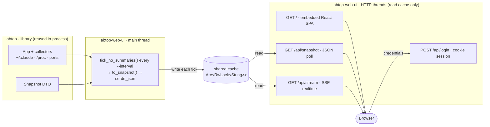

# abtop-web-ui

**English** · [简体中文](README.zh_CN.md)

**Watch every AI coding agent on your machine, from your browser.**

[](https://github.com/XKHoshizora/abtop-web-ui/releases)
[](LICENSE)


A local-first **web UI** for [abtop](https://github.com/graykode/abtop) — every
Claude Code, Codex CLI, and OpenCode session in one live dashboard: status, tokens,
context, rate limits, child processes, open ports, MCP servers and git state,
streamed in real time behind a real login page.

It **does not reimplement any scanning.** It reuses abtop's data-collection layer
in-process (via the `abtop` library), runs the same collector loop headless, and
serves the snapshot as JSON + Server-Sent Events behind a React / Ant Design SPA
that is embedded into the binary. The abtop TUI is untouched.

## Features

- **Live by default** — Server-Sent Events push updates as they happen, with an
  automatic polling fallback; session cards animate in and out with spring physics.
- **Every session at a glance** — cards show status (pulsing Thinking / Executing /
  Waiting / RateLimited / Done dots), agent CLI, model & effort, project, current
  task, git branch (`+added` / `~modified`), memory, uptime and turn count.
- **Click any card for the full story** — a detail drawer with a token-composition
  bar (input / output / cache-write / cache-read), token & context sparklines, a
  copyable session id, cwd, config root, child processes, subagents, a tool-call
  timeline, and the recent chat tail.
- **Context & token pressure** — animated context-fill bars (cyan → red), a live
  tokens/second rate, and per-session compaction counts.
- **Account rate limits** — Claude 5-hour and 7-day windows as fill bars with reset
  countdowns (needs `abtop --setup`).
- **Host vitals** — CPU %, memory % and 1-minute load in the header (Linux only).
- **Open & orphan ports** — ports left listening by sessions that have ended, with
  PID, command and project.
- **MCP servers** — detected MCP servers with parent CLI, profile and rollout activity.
- **A real login page** — username + password with a cookie session, not a browser
  Basic-auth dialog. Auth is off by default on localhost.
- **Bilingual & themed** — English / 中文 and dark / light, toggled from the header
  (and the login page) and remembered locally.
- **One self-contained binary** — the SPA is embedded via `rust-embed`; no Node at
  runtime, no static file server to wire up.

> Want to see it before installing anything? `abtop-web-ui --demo` serves abtop's
> built-in demo fixture, so the whole dashboard is populated without any live agents.

## Screenshots

The dashboard ships dark and light themes (English / 中文). Shown below with the
`--demo` fixture — no real session data:

| Dark | Light |
|:----:|:-----:|
|  |  |

Click any session card for a detail drawer — token composition, a token-trend
sparkline, the context bar, full metadata, child processes, subagents, the tool-call
timeline and the recent chat tail:

<p align="center">
  
</p>

## Requirements

- **Upstream [`abtop`](https://github.com/graykode/abtop) ≥ v0.4.8** — this tool builds
  on abtop's library API (`App::to_snapshot`, `Snapshot`, `tick_no_summaries`),
  upstreamed in v0.4.8. It's pulled automatically as a git dependency, so there's
  nothing to install separately; prebuilt binaries bundle it.
- **Linux** for host CPU / MEM / load vitals (read from `/proc`). macOS binaries run
  fine but without system metrics.
- **`abtop --setup`** *(optional)* to enable Claude rate-limit tracking — it installs
  the status-line hook abtop reads quota from.

## Install (prebuilt binary)

```bash
curl --proto '=https' --tlsv1.2 -LsSf \
  https://raw.githubusercontent.com/XKHoshizora/abtop-web-ui/master/install.sh | sh
```

Downloads the binary for your platform (Linux / macOS, x86_64 / arm64) into
`~/.local/bin` (override with `ABTOP_WEB_UI_BIN`), then:

```bash
abtop-web-ui --open      # serve http://127.0.0.1:8787/ and open it
abtop-web-ui --demo      # explore the demo fixture — no live agents needed
```

Prebuilt binaries are published to
[GitHub Releases](https://github.com/XKHoshizora/abtop-web-ui/releases) by the
release workflow on each `v*` tag. (Windows: build from source.)

## 🤖 Install with an AI agent

Letting an AI coding agent set this up for you? Copy the prompt below to **Claude Code**,
**Codex**, **OpenCode** (or any agent) — it installs the binary, asks how you want to run
it, and once you approve the plan, carries it out for you.

```text
You are setting up **abtop-web-ui** on this machine for me. It's a local-first web
dashboard that monitors every AI coding agent running on *this host* (Claude Code,
Codex CLI, OpenCode) — status, tokens, context, ports, MCP servers — streamed to a
browser behind a login page. Project: https://github.com/XKHoshizora/abtop-web-ui

Canonical sources (read these first if you can fetch URLs; otherwise follow the steps):
- README:    https://github.com/XKHoshizora/abtop-web-ui#readme
- Installer:  https://raw.githubusercontent.com/XKHoshizora/abtop-web-ui/master/install.sh

Install (Linux / macOS, x86_64 / arm64):
  curl --proto '=https' --tlsv1.2 -LsSf https://raw.githubusercontent.com/XKHoshizora/abtop-web-ui/master/install.sh | sh
It drops the binary in ~/.local/bin (prebuilt binaries bundle everything — no extra
deps). On Windows, build from source per the README. Then verify with
`abtop-web-ui --version`, and offer me a no-data demo: `abtop-web-ui --demo --open`.

Then ask me how I want to run it:
- Foreground / just try it:  abtop-web-ui --open   -> http://127.0.0.1:8787
- Install as a background service (`abtop-web-ui deploy`, systemd, Linux): ask whether I want
    - local  — binds 127.0.0.1, no password; I reach it via an SSH tunnel, or
    - public — generates a password and prints (or, with --caddy-append, writes) a
               Caddy TLS reverse-proxy vhost for a domain I give you.

Rules — follow these:
- It's local-first: it can only watch agents on *this* machine, and the service must
  run as the SAME user that owns the agent processes (it reads that user's ~/.claude
  and /proc). Run it as me, never as root.
- `deploy` runs privileged steps with sudo (systemd, Caddy). First show me the plan —
  run `abtop-web-ui deploy --dry-run <flags>` and let me read it — and only execute
  privileged or public-exposure steps after I approve.
- Never expose it publicly without TLS AND a password. The snapshot contains cwd
  paths, ports, PIDs and (redacted) prompt text.

Once I've approved the plan, carry it out yourself — run the commands, handle
PATH/sudo, and report back when the dashboard is reachable.
```

## Deploy as a service

`abtop-web-ui deploy` installs a systemd service (Linux). It asks whether you want
**local** or **public** if you don't pass `--local` / `--public`:

```bash
abtop-web-ui deploy --local                          # bind 127.0.0.1 (localhost / SSH tunnel)
abtop-web-ui deploy --public --domain abtop.you.com  # + generated password + Caddy vhost
abtop-web-ui deploy --public --domain abtop.you.com --caddy-append   # also write & reload the vhost
abtop-web-ui deploy --dry-run --public --domain ...  # print the plan, change nothing
```

- **local** binds `127.0.0.1` with no password by default — reach it over an SSH
  tunnel: `ssh -L 8787:localhost:8787 <host>`.
- **public** generates a strong password (stored in `/etc/abtop-web-ui.env`, mode
  600), runs the service on localhost, and prints a Caddy `reverse_proxy` vhost for
  your domain — or appends it to `/etc/caddy/Caddyfile` and reloads with
  `--caddy-append`. Always keep TLS in front (Caddy / Cloudflare); the snapshot
  exposes cwd paths, ports and prompt text.
- Privileged steps use `sudo` unless you are already root. The service runs as the
  user who runs `deploy`, so run it as the **same user whose agents you want to
  monitor** — it needs to read their `~/.claude` and processes.

Other deploy flags: `--port <n>` (default 8787), `--password <pw>`, `--username <u>`
(default `admin`), `--user <u>` (service user), `-y` / `--yes` (non-interactive;
defaults to `--local`). Installs the binary to `/usr/local/bin/abtop-web-ui` and the
unit to `/etc/systemd/system/abtop-web-ui.service`.

## Uninstall

Installed as a service with `abtop-web-ui deploy`? Remove it with one command:

```bash
abtop-web-ui uninstall             # stop + disable the service, remove the unit,
                                   # env file and binary
abtop-web-ui uninstall --keep-bin  # ...but keep the binary
abtop-web-ui uninstall --dry-run   # print the plan, change nothing
abtop-web-ui uninstall -y          # non-interactive (skip the confirmation)
```

Privileged steps use `sudo` unless you are already root. It stops and disables the
service, deletes `/etc/systemd/system/abtop-web-ui.service`, runs `systemctl
daemon-reload`, removes `/etc/abtop-web-ui.env`, and — unless `--keep-bin` — the
binary at `/usr/local/bin/abtop-web-ui` (and the running executable, e.g. the
`~/.local/bin` copy from `install.sh`).

Equivalent manual steps (for older binaries without the subcommand):

```bash
sudo systemctl disable --now abtop-web-ui
sudo rm -f /etc/systemd/system/abtop-web-ui.service /etc/abtop-web-ui.env /usr/local/bin/abtop-web-ui
sudo systemctl daemon-reload
rm -f ~/.local/bin/abtop-web-ui          # if you installed via install.sh
```

If you exposed it publicly with `deploy --caddy-append`, also remove the abtop
`reverse_proxy` vhost from `/etc/caddy/Caddyfile` and reload Caddy
(`sudo systemctl reload caddy`) — `uninstall` won't touch your Caddyfile. A
pre-append backup is at `/etc/caddy/Caddyfile.bak-abtop-deploy`.

## Build from source

The frontend (`web/`, Vite + React + TypeScript + Ant Design) is built to `web/dist`
and **embedded into the Rust binary**, so build it first. The `abtop` library is
pulled automatically from git (pinned in `Cargo.toml`) — no sibling checkout needed:

```bash
cd web && pnpm install && pnpm build      # → web/dist  (must run before cargo)
cd .. && cargo run --release -- --open    # serves http://127.0.0.1:8787/
```

> Hacking on `abtop` itself? Point the dependency at a local checkout —
> `abtop = { path = "../abtop" }` in `Cargo.toml`.

## Development

```bash
cd web && pnpm dev        # Vite hot reload, proxies /api → 127.0.0.1:8791
cargo run -- --port 8791  # in another terminal: the API the dev server proxies to
pnpm typecheck            # tsc --noEmit (the production build does NOT typecheck)
cargo test                # auth / session unit tests live in src/server.rs
```

`pnpm` is provisioned via [mise](https://mise.jdx.dev) here (`mise install`). After
any frontend change, run `pnpm build` before `cargo build` — `rust-embed` bakes
`web/dist` into the binary at compile time, so a stale `dist` ships a stale UI.

## Configuration

| Flag / env | Default | Description |
|------------|---------|-------------|
| `--host <ip>` | `127.0.0.1` | Bind address |
| `--port <n>` | `8787` | Bind port |
| `--interval <secs>` | `2` | Collector refresh interval (min 1) |
| `--open` | – | Open the dashboard in your browser |
| `--demo` | – | Serve abtop's demo fixture (no live agents needed) |
| `--password <pw>` / `ABTOP_WEB_PASSWORD` | – | Require login (`--password` wins) |
| `ABTOP_WEB_USERNAME` | `admin` | Login username |

## How it works



- **`abtop::App` is not `Send`** (it owns boxed collector trait objects), so it lives
  on the main collector thread. Each tick serializes one snapshot into a shared
  `Arc<RwLock<String>>`; HTTP handler threads only ever read that string — they never
  touch the `App`. If a tick fails to serialize, the last good snapshot is kept, so
  the feed never blanks.
- The loop runs `tick_no_summaries`, so it **never** spawns `claude --print` and never
  spends your Claude quota. Titles fall back to the raw first prompt.
- Token-rate and orphan-port detection work because the same long-lived `App` is
  reused across ticks — they need cross-tick deltas and history.
- Auth is a **cookie session** with a real login page — no Basic-auth dialog. Without
  `--password`, auth is disabled (the localhost default).
- **Local-first:** it monitors the agents on the machine it runs on (`~/.claude`,
  `/proc`, ports). It can't watch agents on another host — run it where the agents
  are. Rate-limit data needs `abtop --setup`; host vitals are Linux-only.

## Remote access & security

The snapshot is sensitive (cwd paths, ports, PIDs, best-effort-redacted prompt text).
It binds to `127.0.0.1` by default. To expose it, prefer:

1. **SSH tunnel:** `ssh -L 8787:localhost:8787 you@host`
2. **TLS reverse proxy + login** — e.g. Caddy auto-HTTPS in front, with `--password`:
   ```caddy
   abtop.example.com {
       reverse_proxy 127.0.0.1:8787 {
           flush_interval -1   # keep SSE flowing
       }
   }
   ```

A password over plain HTTP is sniffable — always pair `--password` with TLS for
public exposure. Binding to a non-local `--host` without a password prints a warning.

## Related

- [abtop](https://github.com/graykode/abtop) — the upstream TUI and library this builds
  on; the `Snapshot` / `App::to_snapshot` / `tick_no_summaries` API landed in v0.4.8
  ([#133](https://github.com/graykode/abtop/pull/133)).

## Star History

<a href="https://www.star-history.com/?repos=XKHoshizora%2Fabtop-web-ui&type=date&legend=top-left">
 <picture>
   <source media="(prefers-color-scheme: dark)" srcset="https://api.star-history.com/chart?repos=XKHoshizora/abtop-web-ui&type=date&theme=dark&legend=top-left" />
   <source media="(prefers-color-scheme: light)" srcset="https://api.star-history.com/chart?repos=XKHoshizora/abtop-web-ui&type=date&legend=top-left" />
   
 </picture>
</a>

## License

MIT — see [LICENSE](LICENSE).
