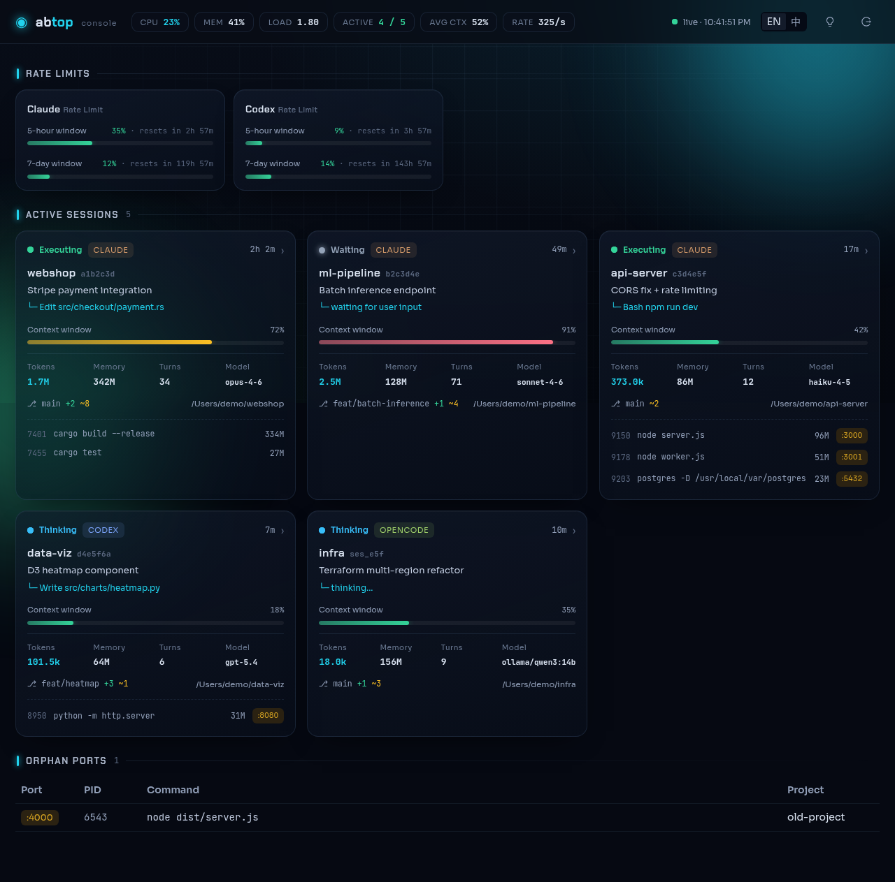
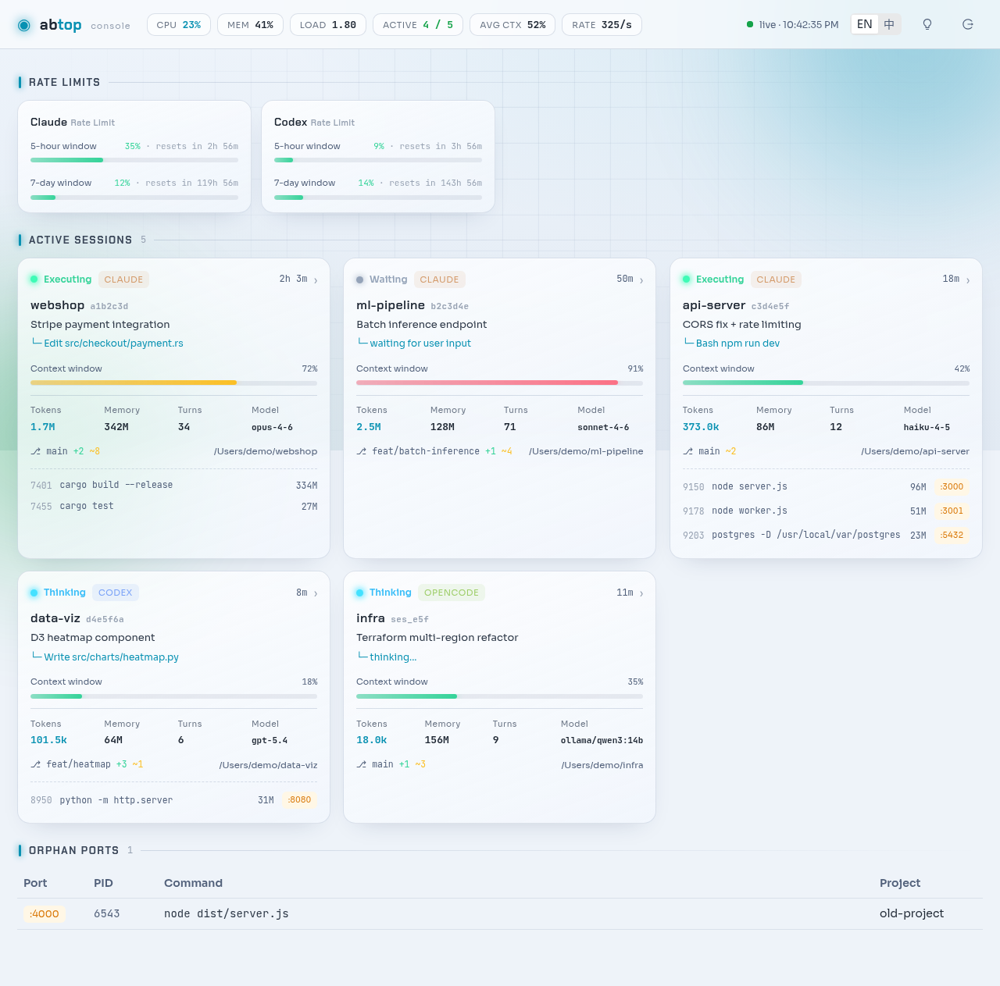
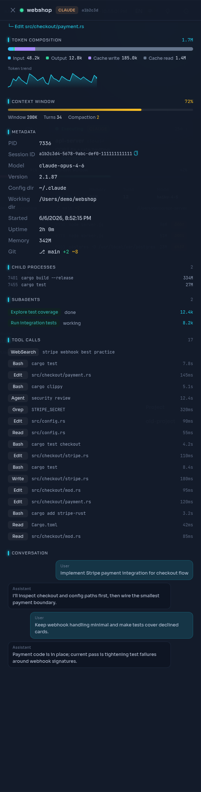
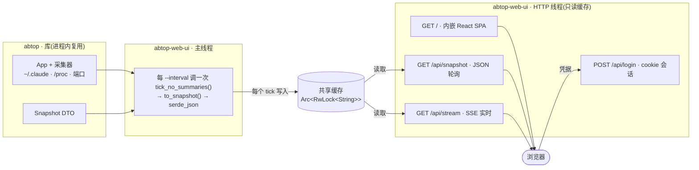

# abtop-web-ui

[English](README.md) · **简体中文**

**在浏览器里盯着本机上的每一个 AI 编码 agent。**

[](https://github.com/XKHoshizora/abtop-web-ui/releases)
[](LICENSE)


[abtop](https://github.com/graykode/abtop) 的本地优先 **Web UI**——把每一个 Claude Code、
Codex CLI、OpenCode 会话汇聚到一个实时仪表盘:状态、token、上下文、速率限制、子进程、
开放端口、MCP 服务器、git 状态,全部实时推送,并有一个真正的登录页守在前面。

它**不重新实现任何扫描**。它在进程内复用 abtop 的数据采集层(通过 `abtop` 库),以无界面方式
跑同一个采集循环,再把快照以 JSON + Server-Sent Events 的形式,交给一个内嵌进二进制的
React / Ant Design SPA 来呈现。abtop 的 TUI 原封不动。

## 功能特性

- **默认实时**——Server-Sent Events 在数据变化时即时推送,并自动回退到轮询;会话卡片
  以弹簧物理动画进出。
- **一眼看尽每个会话**——卡片展示状态(脉动的 Thinking / Executing / Waiting / RateLimited /
  Done 圆点)、agent CLI、模型与 effort、项目、当前任务、git 分支(`+新增` / `~修改`)、
  内存、运行时长、轮次。
- **点开卡片看全貌**——详情抽屉包含 token 构成条(输入 / 输出 / 缓存写 / 缓存读)、token 与
  上下文走势 sparkline、可复制的 session id、cwd、配置目录、子进程、子代理、工具调用时间线,
  以及最近的对话尾部。
- **上下文与 token 压力**——带动画的上下文填充条(青 → 红)、实时的 tokens/秒 速率,以及每个
  会话的压缩(compaction)次数。
- **账户速率限制**——Claude 的 5 小时与 7 天窗口,以填充条 + 重置倒计时呈现(需要
  `abtop --setup`)。
- **主机指标**——头部显示 CPU %、内存 % 和 1 分钟负载(仅 Linux)。
- **开放端口与孤儿端口**——会话结束后仍在监听的端口,带 PID、命令和所属项目。
- **MCP 服务器**——检测到的 MCP 服务器,含父 CLI、profile 和 rollout 活动。
- **真正的登录页**——用户名 + 密码 + cookie 会话,而不是浏览器原生的 Basic-Auth 弹窗。
  在 localhost 上默认关闭鉴权。
- **双语与主题**——English / 中文,暗色 / 亮色,可在头部(及登录页)切换并本地记住。
- **单文件自包含**——SPA 通过 `rust-embed` 内嵌;运行时无需 Node,也不用单独起静态文件服务。

> 想先看看再决定装不装?`abtop-web-ui --demo` 会加载 abtop 内置的演示数据,整个仪表盘
> 都会被填满,完全不需要任何在跑的 agent。

## 截图

仪表盘自带暗色与亮色主题(English / 中文)。下图使用 `--demo` 演示数据——不含任何真实会话:

| 暗色 | 亮色 |
|:----:|:----:|
|  |  |

点击任意会话卡片即可打开详情抽屉——token 构成、token 走势 sparkline、上下文条、完整元数据、
子进程、子代理、工具调用时间线,以及最近的对话尾部:

<p align="center">
  
</p>

## 前置要求

- **上游 [`abtop`](https://github.com/graykode/abtop) ≥ v0.4.8**——本工具基于 abtop 的库
  接口(`App::to_snapshot`、`Snapshot`、`tick_no_summaries`),这套接口已在 v0.4.8 合入上游。
  它作为 git 依赖自动拉取,无需单独安装;预编译二进制已内置。
- **Linux** 才有主机 CPU / 内存 / 负载指标(读取自 `/proc`)。macOS 二进制可正常运行,但没有
  系统指标。
- **`abtop --setup`** *(可选)*,用于启用 Claude 速率限制追踪——它会安装 abtop 读取额度所需的
  状态栏钩子。

## 安装(预编译二进制)

```bash
curl --proto '=https' --tlsv1.2 -LsSf \
  https://raw.githubusercontent.com/XKHoshizora/abtop-web-ui/master/install.sh | sh
```

下载对应平台(Linux / macOS,x86_64 / arm64)的二进制到 `~/.local/bin`(可用
`ABTOP_WEB_UI_BIN` 覆盖),然后:

```bash
abtop-web-ui --open      # 启动 http://127.0.0.1:8787/ 并打开
abtop-web-ui --demo      # 用演示数据体验 —— 不需要任何在跑的 agent
```

预编译二进制由发布工作流在每个 `v*` tag 上发布到
[GitHub Releases](https://github.com/XKHoshizora/abtop-web-ui/releases)。(Windows:请从源码构建。)

## 🤖 让 AI agent 帮你安装部署

想让 AI 编码 agent 帮你把它装好?把下面这段 prompt 复制给 **Claude Code**、**Codex**、
**OpenCode**(或任意 agent)——它会装好二进制、问你想怎么跑,在你确认计划后替你执行。

```text
你正在帮我在这台机器上安装并运行 **abtop-web-ui**。它是一个本地优先的 Web 仪表盘,用来
监控运行在*本机*上的每一个 AI 编码 agent(Claude Code、Codex CLI、OpenCode)——状态、
token、上下文、端口、MCP 服务器等,实时推送到浏览器,前面有登录页守着。
项目地址:https://github.com/XKHoshizora/abtop-web-ui

权威信息源(如果你能抓取网页,请先读它们;否则按下面的步骤执行):
- README:   https://github.com/XKHoshizora/abtop-web-ui#readme
- 安装脚本: https://raw.githubusercontent.com/XKHoshizora/abtop-web-ui/master/install.sh

安装(Linux / macOS,x86_64 / arm64):
  curl --proto '=https' --tlsv1.2 -LsSf https://raw.githubusercontent.com/XKHoshizora/abtop-web-ui/master/install.sh | sh
脚本会把二进制装到 ~/.local/bin(预编译二进制已自带所需的一切,无需额外依赖)。Windows
请按 README 从源码构建。装好后用 `abtop-web-ui --version` 验证,并可以给我演示一下无真实
数据的 demo:`abtop-web-ui --demo --open`。

然后问我想怎么跑:
- 前台 / 先试试:  abtop-web-ui --open   -> http://127.0.0.1:8787
- 装成后台服务(`abtop-web-ui deploy`,systemd,Linux):问我要
    - 本地(local)  —— 绑定 127.0.0.1、不设密码,我通过 SSH 隧道访问;或
    - 公网(public)—— 生成一个密码,并打印(或加上 --caddy-append 直接写入)一段针对
                      我给你的域名的 Caddy TLS 反向代理 vhost。

规则——务必遵守:
- 它是本地优先的:只能监控*这台*机器上的 agent,而且服务必须以拥有这些 agent 进程的
  同一个用户身份运行(它要读取该用户的 ~/.claude 和 /proc)。请以我的身份运行,绝不用 root。
- `deploy` 会用 sudo 执行特权步骤(systemd、Caddy)。先把计划给我看——运行
  `abtop-web-ui deploy --dry-run <参数>` 让我过目——只有在我确认之后,才执行特权或对外
  暴露的步骤。
- 没有 TLS 和密码,绝不要把它暴露到公网。快照里含有 cwd 路径、端口、PID 和(已脱敏的)
  prompt 文本。

我确认计划之后,你就自己把它执行完——运行命令、处理好 PATH/sudo,等仪表盘可访问了再回报我。
```

## 部署为服务

`abtop-web-ui deploy` 会安装一个 systemd 服务(Linux)。如果你不传 `--local` / `--public`,
它会询问你想要 **本地** 还是 **公网**:

```bash
abtop-web-ui deploy --local                          # 绑定 127.0.0.1(本地 / SSH 隧道)
abtop-web-ui deploy --public --domain abtop.you.com  # + 生成密码 + Caddy vhost
abtop-web-ui deploy --public --domain abtop.you.com --caddy-append   # 同时写入并重载 vhost
abtop-web-ui deploy --dry-run --public --domain ...  # 只打印计划,什么都不改
```

- **本地**默认绑定 `127.0.0.1` 且不设密码——通过 SSH 隧道访问:
  `ssh -L 8787:localhost:8787 <host>`。
- **公网**会生成一个强密码(存到 `/etc/abtop-web-ui.env`,权限 600),让服务跑在 localhost 上,
  并打印一段针对你域名的 Caddy `reverse_proxy` vhost——或用 `--caddy-append` 直接追加到
  `/etc/caddy/Caddyfile` 并重载。前面务必挡一层 TLS(Caddy / Cloudflare);快照会暴露 cwd
  路径、端口和 prompt 文本。
- 特权步骤在非 root 时使用 `sudo`。服务以运行 `deploy` 的用户身份运行,所以请用**你想监控的
  agent 所属的同一个用户**来执行它——它需要读取该用户的 `~/.claude` 和其进程。

其他 deploy 参数:`--port <n>`(默认 8787)、`--password <pw>`、`--username <u>`(默认
`admin`)、`--user <u>`(服务运行用户)、`-y` / `--yes`(非交互,默认 `--local`)。会把二进制装到
`/usr/local/bin/abtop-web-ui`,unit 装到 `/etc/systemd/system/abtop-web-ui.service`。

## 卸载

用 `abtop-web-ui deploy` 装成服务的,一条命令卸载:

```bash
abtop-web-ui uninstall             # 停止+禁用服务,删除 unit、env 文件和二进制
abtop-web-ui uninstall --keep-bin  # ……但保留二进制
abtop-web-ui uninstall --dry-run   # 只打印计划,什么都不改
abtop-web-ui uninstall -y          # 非交互(跳过确认)
```

特权步骤在非 root 时使用 `sudo`。它会停止并禁用服务、删除
`/etc/systemd/system/abtop-web-ui.service`、执行 `systemctl daemon-reload`、删除
`/etc/abtop-web-ui.env`,并且——除非 `--keep-bin`——删除位于
`/usr/local/bin/abtop-web-ui` 的二进制(以及当前正在运行的可执行文件,例如
`install.sh` 装在 `~/.local/bin` 的那份)。

等价的手动步骤(没有该子命令的旧二进制):

```bash
sudo systemctl disable --now abtop-web-ui
sudo rm -f /etc/systemd/system/abtop-web-ui.service /etc/abtop-web-ui.env /usr/local/bin/abtop-web-ui
sudo systemctl daemon-reload
rm -f ~/.local/bin/abtop-web-ui          # 如果你用 install.sh 装过
```

如果你用 `deploy --caddy-append` 对外暴露过,还要从 `/etc/caddy/Caddyfile` 移除 abtop
的 `reverse_proxy` vhost 段并重载 Caddy(`sudo systemctl reload caddy`)——`uninstall`
不会改你的 Caddyfile。追加前的备份在 `/etc/caddy/Caddyfile.bak-abtop-deploy`。

## 从源码构建

前端(`web/`,Vite + React + TS + Ant Design)会被构建到 `web/dist` 并**内嵌进 Rust 二进制**,
所以要先构建它。`abtop` 库会作为 git 依赖自动拉取(版本固定在 `Cargo.toml`),无需克隆同级目录:

```bash
cd web && pnpm install && pnpm build      # → web/dist(必须在 cargo 之前)
cd .. && cargo run --release -- --open    # 启动 http://127.0.0.1:8787/
```

> **Windows** 上 Rust 编译需要 C/C++ 链接器:安装 **Visual Studio Build Tools** 并勾选
> *使用 C++ 的桌面开发* 工作负载(为默认的 `x86_64-pc-windows-msvc` 目标提供 `link.exe`),
> 或改用 MinGW-w64 工具链 `rustup default stable-x86_64-pc-windows-gnu`。另外:仪表盘的会话
> 与主机指标在 Linux/macOS 上表现最佳——主机指标仅 Linux 可用,OpenCode 检测需要 `PATH` 里有
> `sqlite3`。

> 想改 `abtop` 本身?把依赖指到本地检出即可:`Cargo.toml` 里 `abtop = { path = "../abtop" }`。

## 开发

```bash
cd web && pnpm dev        # Vite 热更新,把 /api 代理到 127.0.0.1:8791
cargo run -- --port 8791  # 另开一个终端:dev server 要代理到的后端 API
pnpm typecheck            # tsc --noEmit(生产构建不做类型检查)
cargo test                # 鉴权 / 会话单元测试在 src/server.rs
```

这里的 `pnpm` 由 [mise](https://mise.jdx.dev) 提供(`mise install`)。任何前端改动之后,都要在
`cargo build` 之前先 `pnpm build`——`rust-embed` 在编译期把 `web/dist` 烘焙进二进制,所以
过期的 `dist` 会带来过期的界面。

## 配置

| 参数 / 环境变量 | 默认值 | 说明 |
|----------------|--------|------|
| `--host <ip>` | `127.0.0.1` | 绑定地址 |
| `--port <n>` | `8787` | 绑定端口 |
| `--interval <secs>` | `2` | 采集刷新间隔(最小 1) |
| `--open` | – | 在浏览器中打开仪表盘 |
| `--demo` | – | 提供 abtop 演示数据(不需要在跑的 agent) |
| `--password <pw>` / `ABTOP_WEB_PASSWORD` | – | 要求登录(`--password` 优先) |
| `ABTOP_WEB_USERNAME` | `admin` | 登录用户名 |

## 工作原理



- **`abtop::App` 不是 `Send`**(它持有装箱的采集器 trait 对象),所以它常驻在主采集线程上。
  每个 tick 把一份快照序列化进共享的 `Arc<RwLock<String>>`;HTTP 处理线程只读这个字符串——
  从不碰 `App`。如果某个 tick 序列化失败,会保留上一份完好的快照,这样数据流永远不会变空。
- 循环跑的是 `tick_no_summaries`,所以它**绝不**会启动 `claude --print`,也就绝不会花掉你的
  Claude 额度。标题回退到原始的首个 prompt。
- token 速率和孤儿端口检测之所以能工作,是因为同一个长生命周期的 `App` 在多个 tick 间被复用
  ——它们需要跨 tick 的差值和历史。
- 鉴权是带真正登录页的 **cookie 会话**——没有 Basic-Auth 弹窗。不带 `--password` 时,鉴权关闭
  (localhost 默认行为)。
- **本地优先**:它监控自己所在机器上的 agent(`~/.claude`、`/proc`、端口),无法监控另一台主机上
  的 agent——agent 在哪,就把它跑在哪。速率限制数据需要 `abtop --setup`;主机指标仅 Linux。

## 远程访问与安全

快照是敏感的(cwd 路径、端口、PID、尽力脱敏过的 prompt 文本)。它默认绑定 `127.0.0.1`。要对外
暴露,优先选择:

1. **SSH 隧道:** `ssh -L 8787:localhost:8787 you@host`
2. **TLS 反向代理 + 登录**——例如前面挡一层 Caddy 自动 HTTPS,并配上 `--password`:
   ```caddy
   abtop.example.com {
       reverse_proxy 127.0.0.1:8787 {
           flush_interval -1   # 保持 SSE 持续刷出
       }
   }
   ```

明文 HTTP 上的密码是可被嗅探的——对外暴露时,务必让 `--password` 与 TLS 配套使用。绑定到非本地
`--host` 而又没有密码时,会打印一条警告。

## 相关项目

- [abtop](https://github.com/graykode/abtop)——本项目所基于的上游 TUI 与库;
  `Snapshot` / `App::to_snapshot` / `tick_no_summaries` 接口已在 v0.4.8 合入上游
  ([#133](https://github.com/graykode/abtop/pull/133))。

## Star 趋势

<a href="https://www.star-history.com/?repos=XKHoshizora%2Fabtop-web-ui&type=date&legend=top-left">
 <picture>
   <source media="(prefers-color-scheme: dark)" srcset="https://api.star-history.com/chart?repos=XKHoshizora/abtop-web-ui&type=date&theme=dark&legend=top-left" />
   <source media="(prefers-color-scheme: light)" srcset="https://api.star-history.com/chart?repos=XKHoshizora/abtop-web-ui&type=date&legend=top-left" />
   
 </picture>
</a>

## 许可证

MIT —— 见 [LICENSE](LICENSE)。
